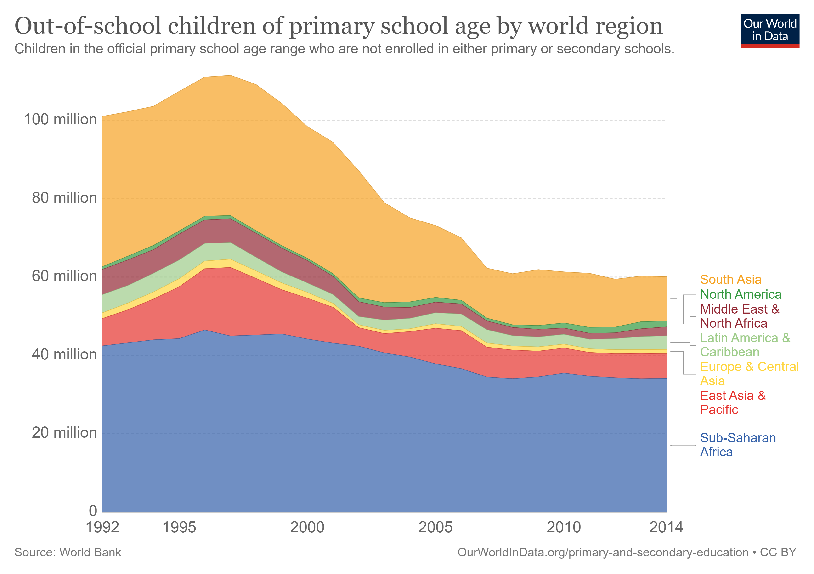

```{r setup, include=FALSE}
knitr::opts_chunk$set(echo = FALSE)
```

**Project**: Demonstrating education inequality among youth across countries  
**Team Members**: Kayla Chea, Kevin Chou, Yanpei Xu, Sinan Zhao  

Info-201: Technical Foundations of Informatics  
The Information School  
University of Washington  
Autumn 2019  

### 1.0 Introduction
**1.1 Problem Situation.**  
The main stakeholders of our problem are the youth not receiving a basic education. The setting of our problem is across the world but is more prominent in lower-income countries. The values tensions in play are countries educating more children vs. countries spending education money on other necessities and children learning vs children supporting their family financially. Some governments may not have policies for free education because they don't have enough money to support it. It could be considered unethical to not provide basic education for all youth though. 

**1.2 What is the problem?**  
The problem is the vast difference in educational opportunities for youth across countries. Depending on their location, which people may not have control over, some youth are receiving a complete education for free while others aren't able to attend primary school. Primary school and secondary school are vital to the emotional, social, and intellectual development of children. They prepare youth for the rest of the world but many aren't attending them.

**1.3 What does it matter?**  
This problem matters because a basic education could be considered a human right of every child. This problem also matters because it not only impacts the future of the youth but also the country as a whole. A good education is vital to succeeding in this world so the economies of countries with few educated youths may suffer. This creates a negative feedback loop where countries with many educated youths grow richer and can provide a better education while countries with few educated youths grow poorer and have less funding for education. 

**1.4 How will it be addressed?**  
We plan to address this problem by creating visualizations that demonstrate the drastic difference in the number of children receiving an education across various countries, particularly between poorer and richer countries. We also plan to demonstrate how the number of out-of-school children correlates to several topics, such as socioeconomic status, literacy rate, or the percentage of gross domestic product (GDP) spent on education. 

### 2.0 Research Questions
**Research Question #1**: How does the out-of-school rate for children and youth compare across countries?  

**Research Question #2**: How does a country's out-of-school rate compare to its literacy rate?

### 3.0 Possible Datasets
#### Data Set #1  
**Name**: ["Education Attainment by 5-year Age Group"](http://www.barrolee.com/) - Barro-Lee Educational Attainment Dataset
**Number of Observations**: 28,471  
**Number of Attributes**: 20  
**Description**:  
This dataset estimates the educational attainment of people by 5-year-age groups from 146 countries in 5-year intervals from 1950 to 2010. These estimates were calculated from 621 census/survey observations by UNESCO, Eurostat, and other sources. This dataset also provides information on the level of schooling and average years of schooling. 

#### Data Set #2
**Name**: ["Children out of school (% of primary school age)"](https://data.worldbank.org/indicator/SE.PRM.UNER.ZS) - World Bank Open Data 
**Number of Observations**: 269 
**Number of Attributes**: 64
**Description**:  
This dataset contains data about the rate of primary school-aged children who aren't attending primary or secondary school for 269 countries from the years 1970 to 2018. This data is from official responses to UNESCO Institute for Statistics' annual education survey.

### 4.0 Information Visualization

Figure 1: This interactive graphic shows the percentage of children who have completed primary school across the entire world. The percentages are presented by dots and the bigger the dot the higher the percentage. If you scroll over a dot you can see the exact percentage. In our project, we may do something similar but also allow users to also see more information about those who have completed primary school, such as gender and socio-economic class.  


Figure 2: This interactive graphic shows the number of out-of-school children of primary school age by world region. It allows users to hover over a year to see the exact numbers or to hover over a region to see only that region. We would like to implement something similar.  

### 5.0 Team Coordination
a. We will be meeting weekly on Friday from 2:00PM to 4:00PM.  

b. Individual Goals:  
* Kayla Chea - wants to learn more about the impact of education inequality on countries and their youth. 
* Kevin Chou - wants to learn more about R and Data Visualization.
* Yanpei Xu - wants to learn R coding and discover more about education inequality.
* Sinan Zhao - wants to learn more about analyzing data.
* Roles - all of our roles are data visualization because each of us are going to analyze a topic related to education inequality across countries and create a visualization for it. 


c. We will communicate weekly through text.  

d. We will give each other feedback on working together by being honest and communicating our thoughts and feelings. We will addresss communication challenges or work breakdowns by sitting down and talking through the problem. 

### 6.0 Questions for Teaching Team
N/A

### 7.0 References
[1] World Inequality Database on Education. (n.d.). Retrieved from https://www.education-inequalities.org/  
[2] Roser, M., & Ortiz-Ospina, E. (2013, July 17). Primary and Secondary Education. Retrieved from https://ourworldindata.org/primary-and-secondary-education
